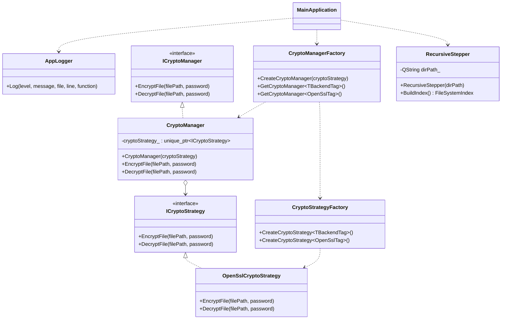

# Лабораторная работа по предмету: "Разработка средств защиты информации"
## Тема: "Рекурсивный шифратор/дешифратор"
> 4 курс 2 семестр \
> Студент группы 932223 - Артеменко Антон Дмитриевич 

## Постановка задачи
> Реализовать защиту данных пользовательских папок и файлов, находящихся в папке, а также под-папках путем шифрования. Для доступа к данным исходной папке необходимо выполнить дешифрование.

## Зависимости проекта
Проект использует следующие сторонние библиотеки:
- **Qt** v5.18
- **OpenSSL** v3.3.6
- **CMake** v3.12 +

## Архитектура решения
Приложение реализовано как консольная программа с использованием классов **Qt Core** и библиотеки **OpenSSL**.

Основные компоненты решения:
- **main.cpp** — точка входа приложения. Проверяет аргументы командной строки, запрашивает пароль пользователя и координирует обработку файлов.
- **RecursiveStepper** — класс, отвечающий за рекурсивный обход целевой директории и построение списка файлов для последующей обработки.
- **ICryptoStrategy / OpenSslCryptoStrategy** — подсистема стратегий шифрования и дешифрования файлов.
- **CryptoManager + фабрики** — менеджер криптографических операций с внедряемой стратегией, создаваемой через tag-based template фабрики
- **AppLogger** — singleton-логгер приложения, который используется в `main.cpp` для фиксации ошибок и ключевых этапов обработки.
- **QDirIterator / QFile / QSaveFile + OpenSSL EVP** — используются для обхода файловой системы, потокового чтения/записи файлов, атомарной замены результата и криптографических операций.

## Алгоритм шифрования

Для защиты файла используется схема на базе **PBKDF2 + AES-256-GCM (AEAD)**.

Шаги шифрования:
1. Генерируется случайная соль `salt` (16 байт).
2. Из пользовательского пароля и `salt` через `PBKDF2-HMAC-SHA256` (200000 итераций) выводится 256-битный ключ.
3. Генерируется случайный `nonce` для GCM (12 байт).
4. Файл шифруется потоково алгоритмом `AES-256-GCM`.
5. Вычисляется и сохраняется `GCM tag` (16 байт), который обеспечивает контроль целостности и подлинности.
6. Результат записывается атомарно через `QSaveFile`, чтобы при ошибке исходный файл не был поврежден.

Формат зашифрованного файла:
`MAGIC | SALT | NONCE | CIPHERTEXT | TAG`

Шаги дешифрования:
1. Читаются `MAGIC`, `SALT`, `NONCE`, `CIPHERTEXT`, `TAG`.
2. По паролю и `SALT` повторно выводится ключ через PBKDF2.
3. Выполняется потоковое дешифрование `AES-256-GCM`.
4. На финальном шаге проверяется `TAG`.

Если пароль неверный или файл был изменен, проверка тега завершается ошибкой, операция прерывается, и исходный файл остается без изменений.

## Предлагаемое решение

### UML-диаграмма классов

#### CryptoManager

## Инструкция для пользователя
Сборка проекта производится следующим образом:

<details>
<summary>Windows</summary>

Создайте директорию `build` и перейдите в нее:
```powershell
mkdir build
cd build
```

> Примечание: если переменная `PATH` не настроена, используйте полные пути к `cmake` и `windeployqt`.

Сконфигурируйте и соберите проект:
```powershell
cmake .. && cmake --build .
```

При необходимости разверните Qt-зависимости рядом с `.exe`:

```powershell
<path>\windeployqt .\recursive_encoder.exe
```

Запустите программу:
```powershell
.\recursive_encoder.exe <MODE> <ENCODING_TARGET>
```

После запуска программа запросит пароль в консоли.

</details>

<details>
<summary>Linux / macOS</summary>

Создайте директорию `build` и перейдите в нее:
```bash
mkdir -p build && cd build
```

Сконфигурируйте и соберите проект:
```bash
cmake ..
cmake --build .
```

Запустите программу:
```bash
./recursive_encoder <MODE> <ENCODING_TARGET>
```

После запуска программа запросит пароль в консоли.

</details>

Описание передаваемых параметров:
* *MODE* - принимает значения
    1. encrypt - шифровать
    2. decrypt - дешифровать
* *ENCODING_TARGET* - путь до шифруемой/дешифруемой директории

## Тестирование

* **Test Case 1:** Шифрование одиночного файла при корректном режиме работы и корректном пароле пользователя.
* **Test Case 2:** Дешифрование ранее зашифрованного файла при использовании правильного пароля.
* **Test Case 3:** Рекурсивное шифрование всех файлов в целевой директории, включая вложенные поддиректории.
* **Test Case 4:** Попытка повторно зашифровать уже зашифрованный файл.
* **Test Case 5:** Попытка дешифрования зашифрованного файла с неверным паролем.
* **Test Case 6:** Попытка дешифрования обычного файла, который не имеет признаков предварительного шифрования.
* **Test Case 7:** Запуск программы с недостаточным количеством аргументов командной строки.
* **Test Case 8:** Запуск программы с путем к директории, которая отсутствует в файловой системе.
*  **Test Case 9:** Запуск программы с недопустимым значением режима работы (отличным от `encrypt` и `decrypt`).
*  **Test Case 10:** Обработка пустой директории, не содержащей файлов для шифрования или дешифрования.