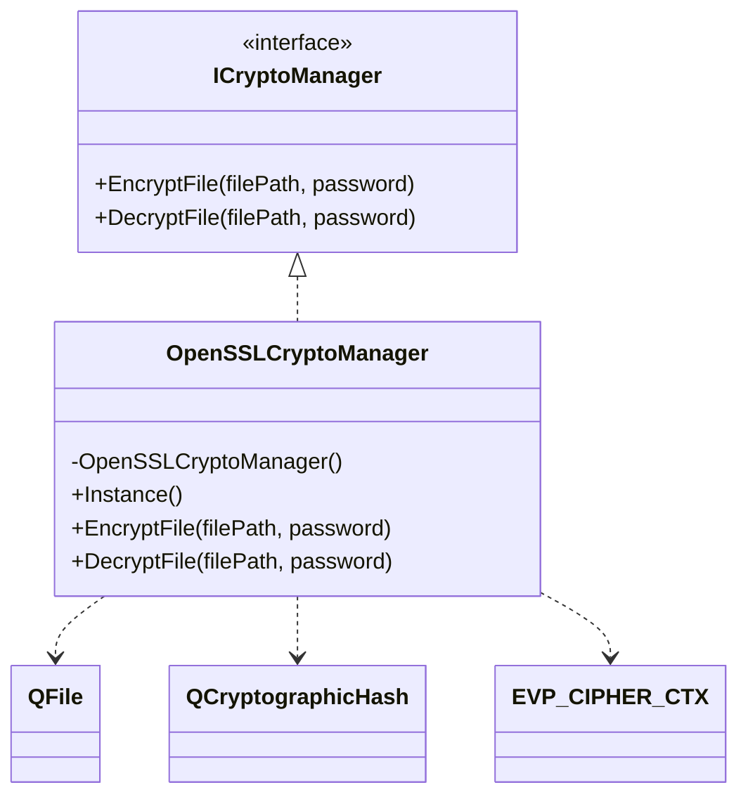
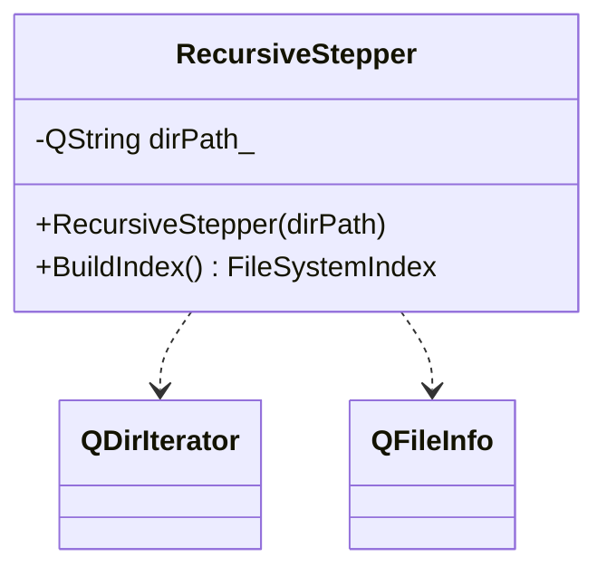
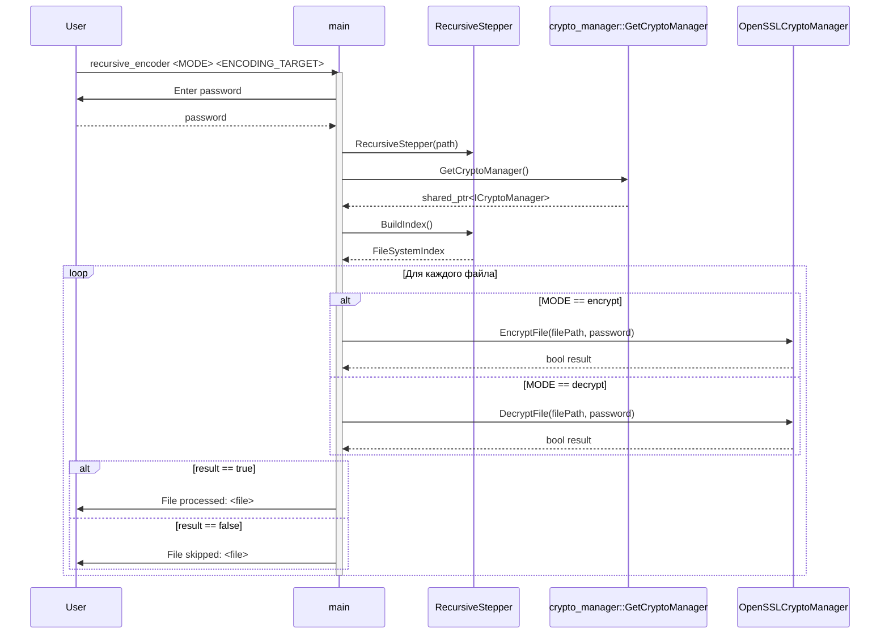

# Лабораторная работа по предмету: "Разработка средств защиты информации"
## Тема: "Рекурсивный шифратор/дешифратор"
> 4 курс 2 семестр \
> Студент группы 932223 - Артеменко Антон Дмитриевич 

## Постановка задачи
> Реализовать защиту данных пользовательских папок и файлов, находящихся в папке, а также под-папках путем шифрования. Для доступа к данным исходной папке необходимо выполнить дешифрование.

## Зависимости проекта
Проект использует следующие сторонние библиотеки:
- **Qt** v5.18
- **OpenSSL** v3.3.6
- **CMake** v3.12 +

## Архитектура решения
Приложение реализовано как консольная программа с использованием классов **Qt Core** и библиотеки **OpenSSL**.

Основные компоненты решения:
- **main.cpp** — точка входа приложения. Проверяет аргументы командной строки, запрашивает пароль пользователя и координирует обработку файлов.
- **RecursiveStepper** — класс, отвечающий за рекурсивный обход целевой директории и построение списка файлов для последующей обработки.
- **ICryptoManager / OpenSSLCryptoManager** — подсистема шифрования и дешифрования файлов на базе OpenSSL с реализацией паттерна Singleton.
- **crypto_manager::GetCryptoManager** — фабричная функция, возвращающая объект менеджера криптографических операций через интерфейс.
- **QDirIterator / QFile / QCryptographicHash** — классы Qt, используемые для обхода файловой системы, чтения и записи файлов, а также получения криптографического ключа из пароля.

## Предлагаемое решение

### UML-диаграмма классов

#### CryptoManager


#### RecursiveStepper


### Диаграмма взаимодействия



## Инструкция для пользователя
Сборка проекта производится следующим образом:

<details>
<summary>Windows</summary>

Создайте директорию `build` и перейдите в нее:
```powershell
mkdir build
cd build
```

> Примечание: если переменная `PATH` не настроена, используйте полные пути к `cmake` и `windeployqt`.

Сконфигурируйте и соберите проект:
```powershell
cmake .. && cmake --build .
```

При необходимости разверните Qt-зависимости рядом с `.exe`:

```powershell
<path>\windeployqt .\recursive_encoder.exe
```

Запустите программу:
```powershell
.\recursive_encoder.exe <MODE> <ENCODING_TARGET>
```

После запуска программа запросит пароль в консоли.

</details>

<details>
<summary>Linux / macOS</summary>

Создайте директорию `build` и перейдите в нее:
```bash
mkdir -p build && cd build
```

Сконфигурируйте и соберите проект:
```bash
cmake ..
cmake --build .
```

Запустите программу:
```bash
./recursive_encoder <MODE> <ENCODING_TARGET>
```

После запуска программа запросит пароль в консоли.

</details>

Описание передаваемых параметров:
* *MODE* - принимает значения
    1. encrypt - шифровать
    2. decrypt - дешифровать
* *ENCODING_TARGET* - путь до шифруемой/дешифруемой директории

## Тестирование

* **Test Case 1:** Шифрование одиночного файла при корректном режиме работы и корректном пароле пользователя.
* **Test Case 2:** Дешифрование ранее зашифрованного файла при использовании правильного пароля.
* **Test Case 3:** Рекурсивное шифрование всех файлов в целевой директории, включая вложенные поддиректории.
* **Test Case 4:** Попытка повторно зашифровать уже зашифрованный файл, который должен быть пропущен.
* **Test Case 5:** Попытка дешифрования зашифрованного файла с неверным паролем.
* **Test Case 6:** Попытка дешифрования обычного файла, который не имеет признаков предварительного шифрования.
* **Test Case 7:** Запуск программы с недостаточным количеством аргументов командной строки.
* **Test Case 8:** Запуск программы с путем к директории, которая отсутствует в файловой системе.
*  **Test Case 9:** Запуск программы с недопустимым значением режима работы (отличным от `encrypt` и `decrypt`).
*  **Test Case 10:** Обработка пустой директории, не содержащей файлов для шифрования или дешифрования.