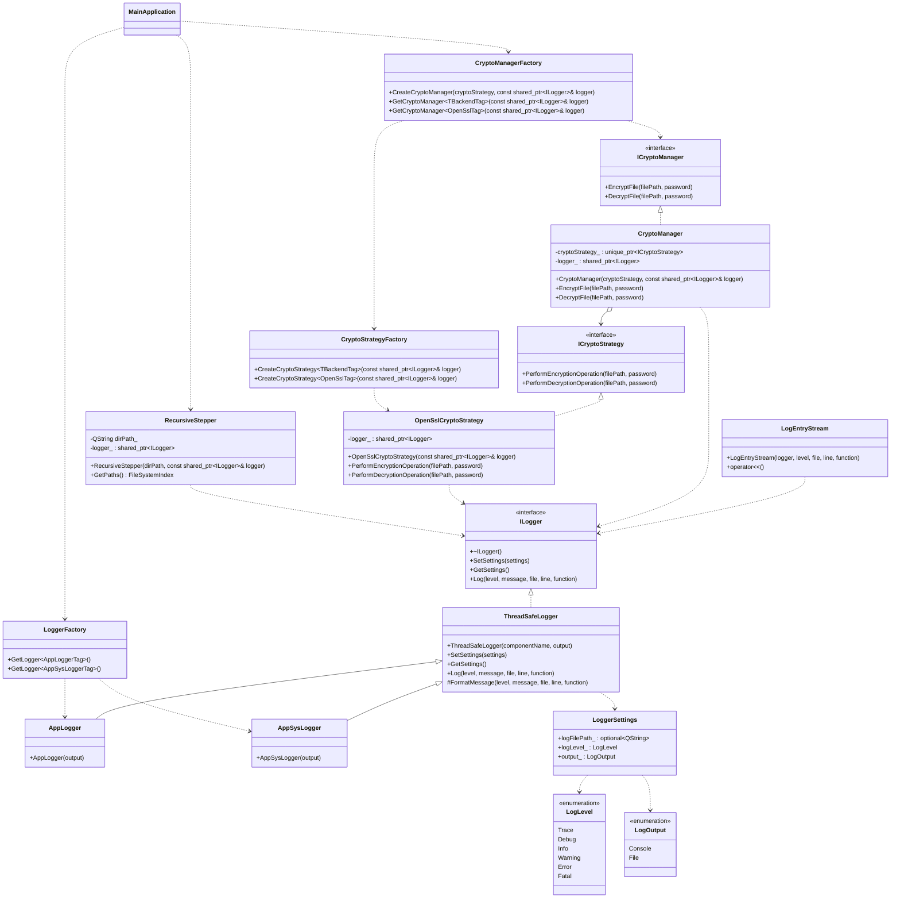

# Лабораторная работа по предмету: "Разработка средств защиты информации"
## Тема: "Рекурсивный шифратор/дешифратор"
> 4 курс 2 семестр \
> Студент группы 932223 - **Артеменко Антон Дмитриевич** 

## 1. Постановка задачи
> Реализовать защиту данных пользовательских папок и файлов, находящихся в папке, а также под-папках путем шифрования. Для доступа к данным исходной папке необходимо выполнить дешифрование.

## 2. Предлагаемое решение
### Зависимости проекта
В проекте используется:
- **Qt** v5.12
- **OpenSSL** v3.3.6
- **CMake** v3.12
- **Стандарт C++** 17

### UML-диаграмма классов


### Архитектура решения
Основные компоненты:
- **main.cpp** — точка входа приложения. Несет ответственность за работу с терминалом и парсинг флагов.
- **recursive_stepper** — модуль, отвечающий за рекурсивный обход целевой директории и построение списка файлов для последующей обработки.
-**crypto_manager** - модуль, отвечающий за шифрование/ дешифрование файлов. Состоит из  
    - **ICryptoStrategy** — подсистема стратегий шифрования и дешифрования файлов
    - **ICryptoManager** — менеджер криптографических операций с внедряемой стратегией
- **logger** - модуль, отвечающий за логирование событий в системе
    - **AppLogger** — singleton-логгер приложения, который используется в `main.cpp` для фиксации ошибок и ключевых этапов обработки.
    - **AppSysLogger** — singleton-логгер подсистем, создается в `main.cpp` и передается в `RecursiveStepper`, `CryptoManager` и `OpenSslCryptoStrategy`

### Алгоритм шифрования

Для защиты файла используется схема на базе **PBKDF2[^tag_1] + AES-256-GCM[^tag_2]**.
[^tag_1]: Password-Based Key Derivation Function 2 — это криптографический алгоритм формирования ключа на основе пароля, описанный в RFC 2898. Он усиливает пароли, применяя хеш-функцию тысячи раз с солью, что замедляет перебор
[^tag_2]: — Высокопроизводительный симметричный алгоритм шифрования, использующий 256-битный ключ (AES-256) в режиме счетчика с аутентификацией Галуа (GCM)

Шаги шифрования:
1. Генерируется случайная соль, размером 16 байт
2. Из пользовательского пароля и соли через хэш-функцию для `PBKDF2` (200000 итераций) формируется 256-битный ключ.
3. Генерируется случайное одноразовое значения, обеспечивающее уникальность шифрования, для GCM, размером 12 байт
4. Файл шифруется алгоритмом `AES-256-GCM`
5. Вычисляется и сохраняется контрольная сумма, размером 16 байт, которая обеспечивает контроль целостности и подлинности
6. Результат записывается атомарно, чтобы при ошибке исходный файл не был поврежден

Итоговый зашифрованный файл содержит в себе:
- *Signature* (обеспечивает невозможность повторного шифрования или ложного дешифрования открытого текста)
- *Salt* 
- *Nonce* (одноразовое значение, актуальное для текущего зашифрованного файла)
- *Шифротекст*
- *Tag* (контрольная сумма, для валидации)

Шаги дешифрования:
1. Читаются *Signature*, *Salt* , *Nonce*, *Шифротекст*, *Tag*
2. По паролю и соли повторно выводится ключ через PBKDF2
3. Выполняется потоковое дешифрование `AES-256-GCM`
4. На финальном шаге проверяется *Tag*
>Если пароль неверный или файл был изменен, проверка тега завершается ошибкой, операция прерывается, и исходный файл остается без изменений.

## Инструкция для пользователя
Сборка проекта производится следующим образом:

<details>
<summary>Windows</summary>

Создайте директорию `build` и перейдите в нее:
```powershell
mkdir build
cd build
```

Сконфигурируйте и соберите проект:
```powershell
cmake .. && cmake --build .
```
Запустите программу:
```powershell
.\recursive_encoder.exe <MODE> <ENCODING_TARGET> <STRATEGY>
```

После запуска программа запросит пароль в консоли.

</details>

<details>
<summary>Linux / macOS</summary>

Создайте директорию `build` и перейдите в нее:
```bash
mkdir -p build && cd build
```

Сконфигурируйте и соберите проект:
```bash
cmake ..
cmake --build .
```

Запустите программу:
```bash
./recursive_encoder <MODE> <ENCODING_TARGET> <STRATEGY>
```

После запуска программа запросит пароль в консоли.

</details>

Описание передаваемых параметров:
* **MODE** - принимает значения
    - *encrypt* - шифровать
    - *decrypt* - дешифровать
* **ENCODING_TARGET** - путь до шифруемой/дешифруемой директории
* **STRATEGY** - принимает значение - *openssl*

## Тестирование

### Unit-тесты (GoogleTest)

Сборка и запуск unit-тестов:

```bash
cmake -S . -B build -DRECURSIVE_ENCODER_BUILD_TESTS=ON
cmake --build build --target build_tests --parallel
ctest --test-dir build --output-on-failure
```

### Генерация отчета о покрытии

Ниже последовательность полного цикла: чистая coverage-сборка, сборка приложения и тестов,
прогон тестов и генерация HTML-отчета покрытия только по исходникам .cpp проекта.

```bash
rm -rf build-coverage
cmake -S . -B build-coverage -DRECURSIVE_ENCODER_BUILD_TESTS=ON -DCMAKE_BUILD_TYPE=Debug -DCMAKE_CXX_FLAGS="--coverage -O0 -g"
cmake --build build-coverage --target recursive_encoder build_tests --parallel
ctest --test-dir build-coverage --output-on-failure

if command -v llvm-cov >/dev/null 2>&1; then
    GCOV_EXEC="$(command -v llvm-cov) gcov"
elif command -v xcrun >/dev/null 2>&1 && xcrun --find llvm-cov >/dev/null 2>&1; then
    GCOV_EXEC="$(xcrun --find llvm-cov) gcov"
else
    GCOV_EXEC="gcov"
fi

cd build-coverage
rm -f coverage_cpp*
find . -name '*.gcov' -delete
gcovr -r .. \
    --gcov-executable "$GCOV_EXEC" \
    --filter ".*/(recursive_stepper/src/.*\.cpp|logger/src/.*\.cpp|crypto_manager/src/.*\.cpp)$" \
    --exclude ".*main\.cpp$" \
    --exclude ".*/test/.*" \
    --exclude ".*/CMakeFiles/.*" \
    --exclude ".*/build-coverage/.*" \
    --exclude ".*CMakeCXXCompilerId\.cpp$" \
    --exclude ".*\.hpp$" \
    --html-details coverage_cpp.html
```

Открыть отчет:

```bash
open build-coverage/coverage_cpp.html
```

### Форматирование кода

Для автоматического форматирования всех исходных файлов используйте команду:

```bash
find . -name "*.cpp" -o -name "*.hpp" | grep -v "/build/" | xargs clang-format -i
```
